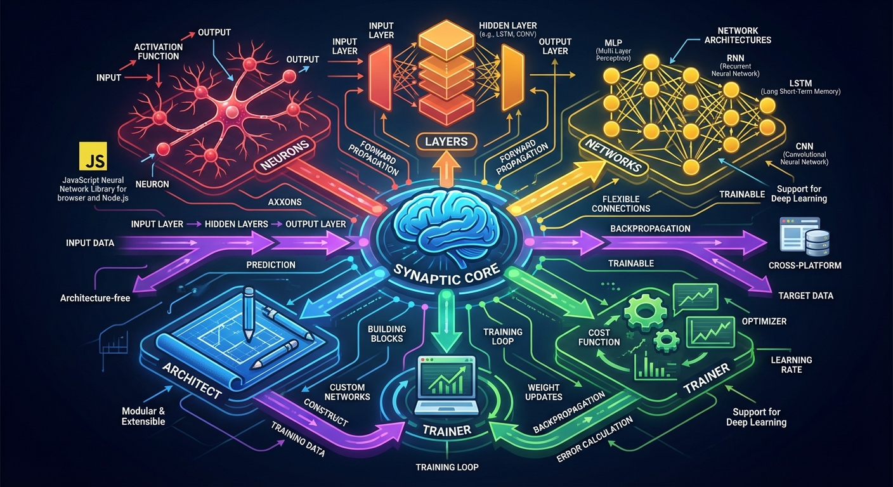

# SynapticBridge



Autonomous, self-correcting MCP orchestration platform for AI agents with Correction Learning Engine (CLE).

## Overview

SynapticBridge is an enterprise-grade platform for deploying AI agents at scale with:
- **Secure Execution Fabric** - Tool manifests, JWT tokens, cryptographic audit logging
- **Correction Learning Engine (CLE)** - Learns from human overrides to predict corrections
- **Autonomous Routing** - Intent-to-tool mapping with multi-hop chain planning
- **Policy & Governance** - OPA policy engine with Rego policies

## Features

- 🔒 **Zero-Trust Security** - SPIFFE/SPIRE workload identity, no env credentials
- 📊 **Real-time Observability** - Call graph visualization, drift detection
- 🔄 **CLE Predictive Dispatch** - 70% reduction in human interruptions
- 🌐 **SIEM Integration** - Splunk, Datadog, GCP, Azure Sentinel
- 📦 **MCP Native** - Works with Claude Code, any MCP-compatible agent

## Quick Start

### Docker

```bash
docker-compose up -d
```

### Manual

```bash
pip install -e .
python -m uvicorn synaptic_bridge.presentation.api.main:app --reload
```

Visit http://localhost:8000/docs for API documentation.

## Architecture

```
┌─────────────────────────────────────────────────────────────┐
│                    Presentation Layer                        │
│  ┌─────────────┐  ┌─────────────┐  ┌─────────────────────┐  │
│  │   FastAPI   │  │     CLI     │  │  Claude Code MCP   │  │
│  └─────────────┘  └─────────────┘  └─────────────────────┘  │
└─────────────────────────────────────────────────────────────┘
                              │
┌─────────────────────────────────────────────────────────────┐
│                    Application Layer                         │
│  ┌──────────┐  ┌──────────┐  ┌──────────────────────┐    │
│  │ Commands  │  │  Queries │  │  DAG Orchestration  │    │
│  └──────────┘  └──────────┘  └──────────────────────┘    │
└─────────────────────────────────────────────────────────────┘
                              │
┌─────────────────────────────────────────────────────────────┐
│                      Domain Layer                           │
│  ┌───────┐ ┌──────────┐ ┌────────┐ ┌───────┐ ┌─────────┐  │
│  │Tools  │ │ Sessions │ │  CLE   │ │Policy │ │ Audit  │  │
│  └───────┘ └──────────┘ └────────┘ └───────┘ └─────────┘  │
└─────────────────────────────────────────────────────────────┘
                              │
┌─────────────────────────────────────────────────────────────┐
│                  Infrastructure Layer                        │
│  ┌──────────┐  ┌────────┐  ┌────────┐  ┌──────────────┐  │
│  │  DuckDB  │  │  OPA   │  │ SPIFFE │  │ SIEM Connect│  │
│  └──────────┘  └────────┘  └────────┘  └──────────────┘  │
└─────────────────────────────────────────────────────────────┘
```

## API Usage

### Create Session

```bash
curl -X POST http://localhost:8000/sessions \
  -H "Content-Type: application/json" \
  -d '{"agent_id": "agent-1", "created_by": "admin"}'
```

### Execute Tool

```bash
curl -X POST http://localhost:8000/execute \
  -H "Content-Type: application/json" \
  -H "Authorization: Bearer <token>" \
  -d '{
    "session_id": "session_xxx",
    "tool_name": "bash.execute",
    "parameters": {"command": "ls"},
    "intent": "list files in directory"
  }'
```

### Capture Correction

```bash
curl -X POST http://localhost:8000/corrections \
  -H "Content-Type: application/json" \
  -d '{
    "session_id": "session_xxx",
    "agent_id": "agent-1",
    "original_intent": "delete all files",
    "original_tool": "bash.execute",
    "corrected_tool": "bash.ls",
    "operator_identity": "admin",
    "confidence_before": 0.5,
    "confidence_after": 0.9
  }'
```

## CLI

```bash
# Register a tool
python -m synaptic_bridge.presentation.cli.main register-tool \
  --name my.tool --version 1.0.0 \
  --capabilities read write --scope workspace

# Add a policy
python -m synaptic_bridge.presentation.cli.main add-policy \
  --name "Deny Network" --rego 'package test\ndeny { input.tool == "network" }' \
  --effect deny --scope network

# Query logs
python -m synaptic_bridge.presentation.cli.main query-logs --session session_xxx
```

## Environment Variables

| Variable | Description | Default |
|----------|-------------|---------|
| `JWT_SECRET` | JWT signing secret | (development) |
| `DUCKDB_PATH` | DuckDB database path | `synaptic_bridge.duckdb` |
| `SPIRE_SOCKET_PATH` | SPIRE agent socket | `/tmp/spire-agent.sock` |
| `SPLUNK_ENDPOINT` | Splunk HEC endpoint | - |
| `DATADOG_API_KEY` | Datadog API key | - |
| `GCP_PROJECT_ID` | GCP project ID | - |

## Testing

```bash
# Unit tests
pytest tests/domain/ -v

# Integration tests
pytest tests/integration/ -v

# All tests with coverage
pytest --cov=synaptic_bridge
```

## Project Stats

| Metric | Value |
|--------|-------|
| Source code (Python) | 5,871 LOC across 39 modules |
| Test code | 3,860 LOC across 8 test suites |
| Test cases | 201 (201 passing, 0 failing) |
| Test coverage | 72% overall, 90%+ on core domain & infrastructure |
| Domain layer coverage | 100% (entities, events, ports, exceptions) |
| CLE engine coverage | 99% (DuckDB store), 93% (intent classifier) |
| Security layer coverage | 90% (WORM audit), 87% (SPIFFE identity) |
| Zero dependencies at domain layer | Pure Python, no framework coupling |

### What's Tested

- **Domain logic** — All entities, value objects, events, and business rules at 100% coverage
- **CLE feedback loop** — End-to-end: correction capture with real embeddings, pattern matching via cosine similarity, tool interception in both shadow and active modes, fallback when corrected tool is missing, exception isolation so CLE never blocks execution
- **Policy engine** — Rego rule parsing, deny/allow evaluation, nested input access, glob matching, built-in policy validation
- **Intent classification** — Deterministic embeddings, keyword-based classification, semantic tool matching, chain planning
- **Drift detection** — Z-score calculation, baseline management, anomaly detection, windowed history
- **Infrastructure** — DuckDB persistence with pattern updates, WORM audit log with chain hashing and tamper detection, SPIFFE identity caching with expiry, SIEM event normalization and severity calculation, call graph tracking with correction overlays
- **API layer** — Session lifecycle, tool registration, policy management, correction capture, auth enforcement, input validation, security headers, error response sanitization (no path leaks)

### What Makes It Different

Most agent frameworks treat tool permissions as static config. SynapticBridge closes the loop: every human correction trains the system to make better decisions autonomously. The CLE stores real intent embeddings (not zero vectors), computes cosine similarity against learned patterns, and either redirects tool calls (active mode) or logs suggestions for review (shadow mode) — all wrapped in exception isolation so the learning layer never blocks execution.

## License

Proprietary - All rights reserved
